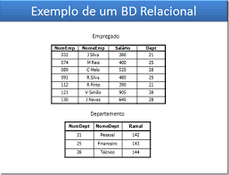
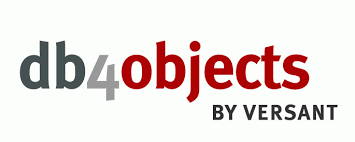

SGDB Relacional (SGBDR):

Um SGDB Relacional (SGBDR) é um Sistema de Gerenciamento de Banco de Dados Relacional. Eles são amplamente utilizados para armazenar e gerenciar dados estruturados em uma variedade de aplicativos e ambientes. Abaixo estão as principais características, funcionalidades e vantagens de um SGBDR, bem como comparações em termos de modelo e estrutura de dados, linguagem de consulta e escalabilidade/desempenho.

Características Principais:

Estrutura Relacional-
Os dados são organizados em tabelas relacionais que consistem em linhas e colunas.
Integridade Referencial: Relações entre tabelas são mantidas através de chaves estrangeiras, garantindo integridade dos dados.

Funcionalidades e Vantagens:
Facilidade de Uso- São geralmente fáceis de entender e usar, especialmente para desenvolvedores familiares com SQL.
Confiabilidade- São conhecidos por sua confiabilidade e estabilidade, com robustos mecanismos de backup e recuperação.
Suporte a Transações: Oferecem suporte a transações complexas, garantindo a consistência dos dados.
Compatibilidade com Padrões: Seguem padrões de mercado, facilitando a integração com outras tecnologias e ferramentas.

Modelo e Estrutura de Dados:
Relacional- Os dados são organizados em tabelas relacionais, onde cada tabela representa uma entidade e as relações são estabelecidas através de chaves.
Não Relacional- Os dados são armazenados em formatos flexíveis, como documentos, grafos ou pares chave-valor, sem a necessidade de um esquema rígido.

Linguagem de Consulta (Query) Usada:

SQL- É a linguagem padrão para interagir com bancos de dados relacionais.
Query Languages específicas: Bancos de dados NoSQL podem ter suas próprias linguagens de consulta, como MongoDB com sua linguagem de consulta baseada em documentos.

Escalabilidade e Desempenho:

Relacional- Geralmente escaláveis verticalmente, adicionando mais recursos ao servidor. Desempenho pode diminuir com o aumento da carga.

Aplicações no Mundo Real:

Aplicativos Empresariais- Sistemas de gestão empresarial (ERP), sistemas de CRM, e-commerce.
Sistemas Financeiros: Bancos, instituições financeiras, processamento de transações.

SGBD Não-Relacional (NoSQL):

Funcionalidades e Vantagens:

Modelos de Dados Flexíveis- Os SGBDs NoSQL suportam uma variedade de modelos de dados, incluindo documentos, grafos, chave-valor e colunas. Isso permite que os desenvolvedores escolham o modelo mais adequado para seus requisitos específicos de aplicação, em vez de se limitarem ao modelo relacional tradicional.
Escalabilidade Horizontal- Os SGBDs NoSQL são projetados para escalar horizontalmente de forma eficiente, adicionando mais servidores conforme a demanda aumenta. Isso facilita a manipulação de grandes volumes de dados e distribui a carga de trabalho de maneira mais uniforme.

Modelo e Estrutura de Dados: 
Os SGBDs NoSQL utilizam uma variedade de modelos de dados, incluindo documentos, grafos, chave-valor e colunas. Esses modelos permitem uma maior flexibilidade na organização e representação dos dados.

Linguagem de Consulta (Query) Usada:
A linguagem de consulta pode variar dependendo do tipo de SGBD NoSQL. Alguns SGBDs NoSQL têm suas próprias linguagens de consulta, enquanto outros podem suportar consultas através de APIs e linguagens de programação.

Escalabilidade e Desempenho: 
Os SGBDs NoSQL são projetados para oferecer alta escalabilidade e desempenho, especialmente para cargas de trabalho distribuídas e de grande escala. Eles podem lidar com grandes volumes de dados e distribuir esses dados em vários nós de forma eficiente.

Casos de Aplicações no Mundo Real:

Redes Sociais- Armazenamento e análise de dados de redes sociais em tempo real.
IoT (Internet das Coisas)- Captura e análise de grandes volumes de dados gerados por dispositivos IoT.

SGBD Orientado a Objetos (SGBDOO):

Os SGBDOO são adequados para situações em que a modelagem de dados orientada a objetos oferece vantagens significativas, como em sistemas complexos onde os dados são altamente relacionados e mutáveis. No entanto, a escolha de um SGBDOO deve considerar cuidadosamente os requisitos específicos do projeto e as habilidades da equipe de desenvolvimento.

Funcionalidades e Vantagens:
Modelagem de Dados Natural- O SGBDOO permite uma modelagem de dados mais natural e próxima do mundo real, visto que os dados são representados como objetos, com atributos e métodos associados. Isso facilita a compreensão e o desenvolvimento de aplicações complexas.
Herança e Polimorfismo- Os SGBDOO suportam conceitos de herança e polimorfismo, permitindo a criação de hierarquias de classes e objetos. Isso facilita a reutilização de código e promove uma estrutura de dados mais flexível e modular.

Modelo e Estrutura de Dados: 
Os SGBDOO são baseados no paradigma de orientação a objetos, onde os dados são representados como objetos que contêm tanto dados quanto métodos para manipular esses dados. Esses objetos podem ser herdados, encapsulados e polimórficos, permitindo uma modelagem mais natural dos dados.

Linguagem de Consulta (Query) Usada:
As linguagens de consulta em SGBDOO podem variar, mas frequentemente incluem extensões de linguagens de programação orientadas a objetos, como Java ou C++. Isso permite que os desenvolvedores utilizem métodos e operadores familiares para consultar e manipular dados.

Escalabilidade e Desempenho:
A escalabilidade e o desempenho dos SGBDOO podem variar dependendo da implementação específica e do tamanho e complexidade dos objetos manipulados. Em geral, eles podem ser escaláveis, mas podem enfrentar desafios com grandes volumes de dados ou com operações que exigem muitos acessos concorrentes aos objetos.

Casos de Aplicações no Mundo Real:

db4o- Um banco de dados orientado a objetos popular, usado em aplicações incorporadas e de pequena escala onde a simplicidade e a integração com a programação orientada a objetos são importantes, como em dispositivos móveis e sistemas embarcados.
Versant Object Database- Utilizado em aplicações que exigem uma modelagem de dados complexa e flexível, como sistemas de gerenciamento de informações geoespaciais e aplicações científicas.

SGBD Em Memória:

Os SGBDs em Memória são ideais para cenários onde a velocidade, a escalabilidade e a baixa latência são essenciais. Eles oferecem vantagens significativas em relação aos SGBDs tradicionais em disco em termos de desempenho e capacidade de resposta, tornando-os uma escolha popular para uma variedade de aplicações em tempo real e de alto desempenho.

Funcionalidades e Vantagens:
Alto Desempenho- Os SGBDs em Memória armazenam dados diretamente na memória RAM, o que resulta em tempos de acesso extremamente rápidos. Isso proporciona um desempenho significativamente superior em comparação com os SGBDs tradicionais que acessam dados em disco.
Baixa Latência- A natureza de acesso direto à memória RAM reduz drasticamente a latência de acesso aos dados. Isso é particularmente crucial para aplicações que exigem tempos de resposta muito curtos, como sistemas de processamento em tempo real e transações financeiras.

Modelo e Estrutura de Dados:
Os SGBDs em Memória armazenam e manipulam dados diretamente na memória RAM, em vez de em discos físicos. Isso resulta em acesso extremamente rápido aos dados e é especialmente útil para aplicações que exigem baixa latência e alto desempenho.

Linguagem de Consulta (Query) Usada:
Geralmente, os SGBDs em Memória suportam uma variedade de linguagens de consulta, incluindo SQL e linguagens específicas de cada sistema. Eles podem oferecer otimizações específicas para consultas em memória que tiram proveito da velocidade de acesso aos dados.

Escalabilidade e Desempenho:
Os SGBDs em Memória são altamente escaláveis horizontalmente e oferecem desempenho excepcional para cargas de trabalho intensivas em leitura e escrita. Eles são capazes de lidar com grandes volumes de transações em tempo real e podem escalar facilmente adicionando mais servidores à infraestrutura.

Casos de Aplicações no Mundo Real:

Sistemas de Análise de Dados em Tempo Real- Os SGBDs em Memória são frequentemente usados em sistemas de análise de dados em tempo real, como processamento de streaming e análise de logs, onde a latência é crítica e as respostas devem ser fornecidas em milissegundos.
Aplicações Financeiras- Em instituições financeiras, os SGBDs em Memória são usados para processar transações de alta frequência, como negociações de ações e processamento de pagamentos, onde a velocidade e a precisão são essenciais.

